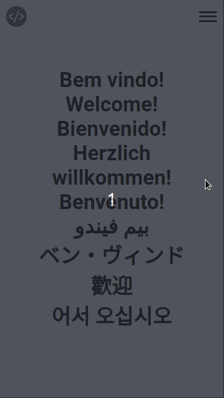

# MyProject Software Client
This is my single project created with React, Styled Component and Typescript to improve my experience and skill with theses technologies. Also it was made to present me for everyone that came here too!

- [Deployed on Netlify](https://giovanialbuquerque.site/)

## Features

<h2 align="center"> Desktop version </h2>
<p align="center">
  
</p>
<br>
<h2 align="center"> Mobile Version </h2>
<p align="center">
  
</p>

---

## Getting Started
These instructions will get you a copy of the project up and running on your local machine for development and testing purposes.

### Prerequisites
You will need to have yarn installed on your machine. For that, simply run:

1. Run this command to download the current stable release of Yarn:
```bash
npm install -g yarn
```

### Installing
To run the project for the **first** time you must follow this steps:

1. Clone the GitHub repository
```bash
git clone https://github.com/Giovaniavs/MyProject-Client.git
```

2. Install the dependencies and start the npm project
```bash
yarn install
```

---

## Running the project
To run the project, just follow this simple command on the client terminal:

```bash
yarn start
```

---

## Git Pattern Project

### Branches
They can be:
+ main
+ develop

### Commits
Must begin with the name of the branch you developed on, following the model: _“Feature(name-of-feature): rest of commit…”._

Must be simple and show briefly what you just did.

Ex: `git commit -m "Feature(home): Added the home in the first section of the landing page"`


---

## The Developer
* **Giovani Albuquerque** - *Developer and Designer* - [Giovaniavs](https://github.com/Giovaniavs)

<p align="right">
  Made by <b> The Giovani Albuquerque </b>
</p>
